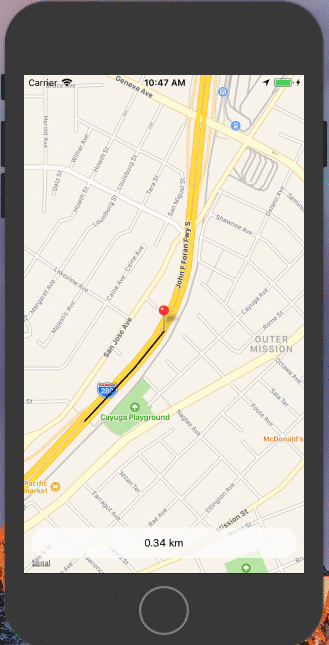

# react-native-location-tracking
Tracks user and draws a path as the user location changes.

Read article posted on [Medium](https://medium.com/quick-code/react-native-location-tracking-14ab2c9e2db8)



## Installation
### npm modules
```npm install```
or
```yarn```

### Pods
```cd ios && pod install```

## Usage
```react-native run-ios```
or
```react-native run-android```

## Debugging
### iOS
* iOS simulator has inbuilt dynamic location tracking debugging mode
* Go to ```Debug > Location > Freeway Drive```

### Android
* Android emulators doesn't have any in built feature to test the dynamic location changes
* You can use 3rd party apps to mock gps location apps. [GPS Joystick](https://play.google.com/store/apps/details?id=com.theappninjas.gpsjoystick&hl=en_IN) was working fine for me

## Troubleshooting
#### App is giving error
* If this repo is not working for you, I would suggest that you create your own [react-native](https://facebook.github.io/react-native/docs/getting-started.html) project
* Install [react-native-maps](https://github.com/react-community/react-native-maps/) using their [installation guide](https://github.com/react-community/react-native-maps/blob/master/docs/installation.md)
* Replace its App.js with this project's App.js

#### Blank Map
* Create new Google Maps API keys
* Go to https://developers.google.com/maps/documentation/ios-sdk/get-api-key and https://developers.google.com/maps/documentation/android-api/signup to get your keys for both iOS and Android.
* Replace them at their respective places

#### App crashes as soon as it launches in Android
* Try giving it the location permission manually to the app by going to the device setting


